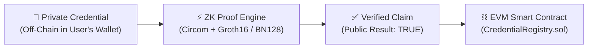

# ClaimPass — Web3 Privacy-Preserving Digital Identity Platform

> **“Prove the claim. Reveal less.”**  
> *“Your credentials belong to you. Your data should stay private.”*

ClaimPass is a production-grade Web3 digital identity platform built with **Next.js 16 (App Router), React 19, TypeScript, Tailwind CSS, Solidity, Circom 2.1.6, snarkjs Groth16, and Ethereum smart contracts**.

---

## 1. Product Vision & Problem Statement

In the modern digital economy, identity verification forces an unacceptable **over-disclosure dilemma**:
- To prove an applicant is **18+ years old**, they must show a full government ID, revealing their exact birth date, home address, and national ID number.
- To prove they hold a **B.Tech degree**, they must submit full academic transcripts and diplomas, revealing student roll numbers, grades, backlogs, and private personal details.
- Corporate databases hoard these raw files, creating massive attack vectors for leaks and identity theft.

**ClaimPass solves this permanently:** Users selectively prove specific claims about their identity using **Zero-Knowledge Proofs (zk-SNARKs)** without revealing any underlying personal data.

---

## 2. Core Architecture Pipeline



### What Verifier Learns:
* B.Tech Holder = YES ✓
* Age >= 18 = YES ✓
* Graduate 2026 = YES ✓
* Student Status = YES ✓

### What Verifier Will NEVER Learn:
* 🔒 Date of Birth (DOB)
* 🔒 Residential Address
* 🔒 Student ID / Roll Number
* 🔒 Raw Academic Records

---

## 3. The 24-Hour Hackathon Demo Flow (Section 23)

### Scenario A: Successful Privacy-Preserving Verification
1. **University Issues Credential:** In the [Issuer Portal](/issuer), XYZ University issues Rahul Kumar's B.Tech degree (Class of 2026, DOB: 12 August 2002). The cryptographic commitment is anchored on-chain in `CredentialRegistry.sol`.
2. **Rahul Logs In via Digital ID:** In the [Login Page](/login), Rahul authenticates with his XYZ University Digital ID. The verifier confirms identity validity while learning zero personal attributes.
3. **Credential Appears in Wallet:** In the [Digital ID Wallet](/wallet), the B.Tech Degree and Student Identity credentials appear with masked private data.
4. **ABC Technologies Creates Verification Request:** In the [Verifier Portal](/verifier), ABC Technologies creates a request:
   - Required Claim: `B.Tech Degree = TRUE`
   - Issuer: `XYZ University`
   - Personal Data Required: `None`
5. **QR Code Verification:** A QR code is generated. Rahul scans or clicks "Scan with ClaimPass Wallet".
6. **Approval & ZK Proof Generation:** Rahul reviews selective disclosure, approves the request, and generates a Groth16 zk-SNARK proof with animated steps.
7. **Blockchain Verification:** Ethereum smart contract verifies issuer authorization + proof pairing + revocation bitmap.
8. **Result:** Verifier displays **`Credential Verified ✓`** and **`🔒 0 Personal Attributes Exposed`**.

### Scenario B: Revocation & Tamper Protection (The "WOW Moment")
1. **University Revokes Credential:** XYZ University revokes the credential in the [Issuer Management](/issuer) portal with an on-chain transaction.
2. **Re-Verification Attempted:** In the Verifier Portal or ClaimPass Prover, the applicant attempts to verify the same credential again.
3. **Instant On-Chain Invalidation:** Verification immediately fails:
   - ZK Proof: Valid ✓
   - Issuer: Trusted ✓
   - Credential: **Revoked ✕**
   - **Message:** *“The cryptographic proof is valid, but the credential has been revoked by the issuer.”*

---

## 4. Smart Contracts & Circom Circuits

### Smart Contracts (`/contracts`)
* [CredentialRegistry.sol](file:///c:/RVS%20HACKATHON/project/contracts/CredentialRegistry.sol):
  - `registerIssuer(address, string)`: Authorizes universities and institutions.
  - `registerCredential(bytes32 credentialId, bytes32 commitment)`: Anchors public cryptographic commitments on-chain.
  - `revokeCredential(bytes32 credentialId)`: Flips the revocation mapping (`mapping(bytes32 => bool) public revoked`).
  - `isRevoked(bytes32 credentialId)`: View method for real-time revocation checks.
  - `getCredentialStatus(bytes32 credentialId)`: Returns existence, revocation state, and issuing authority.
* [IssuerRegistry.sol](file:///c:/RVS%20HACKATHON/project/contracts/IssuerRegistry.sol):
  - On-chain institutional accreditation directory (`registerIssuer`, `verifyIssuer`, `getIssuer`).
* [Verifier.sol](file:///c:/RVS%20HACKATHON/project/contracts/Verifier.sol):
  - Smart contract verifying pairing equations over BN128 curve.

### Circom Arithmetic Circuits (`/src/zk`)
* [degree_btech.circom](file:///c:/RVS%20HACKATHON/project/src/zk/degree_btech.circom): Proves `degreeCode == 101 (B.Tech)` and signature validity without revealing roll number, DOB, or marks.
* [age_18.circom](file:///c:/RVS%20HACKATHON/project/src/zk/age_18.circom): Proves `birthTimestamp + 18 years <= currentTimestamp` using 64-bit comparator without exposing exact DOB.

---

## 5. App Suite Pages & Navigation

* `/`: **Landing Page** with interactive Private Credential → ZK Proof → Verified Claim transformation pipeline.
* `/login`: **Login with Digital ID** featuring selective disclosure review, animated proof states, and instant redirect.
* `/dashboard`: **User Dashboard** showing verified status, 4 metric cards, and primary B.Tech credential card.
* `/wallet`: **Digital ID Wallet** with masked sensitive attributes, emergency credential freeze, and claim links.
* `/claimpass`: **ClaimPass Selective Prover** for all 4 claims (B.Tech, Age 18+, Graduated in 2026, XYZ University Student).
* `/verifier`: **Verifier Portal** with request builder, interactive QR generator/scanner, and blockchain verification card.
* `/issuer`: **University Credential Portal** with issuance form, animated pipeline, and on-chain revocation management.
* `/history`: **Verification History** logging verification audit trails with 0 PII exposed.
* `/privacy`: **Privacy Dashboard** with 100% Minimalist score and cryptographic privacy receipts.
* `/settings`: **Settings & Security** with emergency Freeze Credential switch and connected verifiers.

---

## 6. Running Locally

```bash
# Run the development server
npm.cmd run dev

# Or build for production
npm.cmd run build
npm.cmd run start
```

Access the application in your browser at **http://localhost:3000**.
